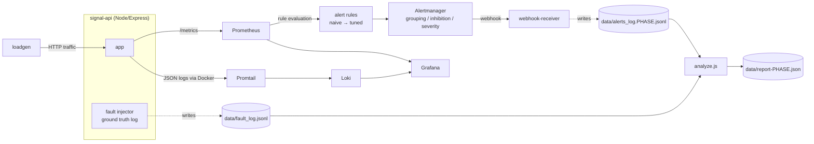

# Signal — Alert Tuning & Anomaly Detection Pipeline

A self-contained observability pipeline that ingests live metrics/logs
from a synthetic service, detects anomalies, fires alerts — and then
deliberately tunes that pipeline to cut noise. Every number in this
README (alert volume, false positive rate, detection rate) is measured,
not estimated: a fault injector logs ground-truth "something is actually
wrong" windows, and an analysis script cross-references every alert that
fired against those windows. See [`docs/tuning-notes.md`](docs/tuning-notes.md)
for the reasoning behind each tuning change and
[`postmortems/`](postmortems/) for three simulated incidents run end to
end against the tuned pipeline.

## Problem statement

Most anomaly-detection tutorials stop at "detect the anomaly." The
harder, more realistic SRE problem is deciding which anomalies deserve
to wake someone up. A pipeline that pages on every blip is worse than no
pipeline — it trains responders to ignore it. This project builds a
naive, noisy alerting setup first (Phase 2), measures exactly how bad it
is, then tunes it (Phase 3) and measures the improvement, using the same
injected faults both times so the comparison is apples-to-apples.

## Architecture



**Why this shape:** the fault injector lives inside the app process and
writes to the same bind-mounted `data/` directory the webhook receiver
writes to. That's what makes the before/after numbers real — `analyze.js`
isn't guessing which alerts were "probably noise," it's checking each
alert's timestamp against a logged fault window.

## Stack

| Concern | Tool |
|---|---|
| Instrumented service + synthetic traffic | Node/Express + `prom-client`, custom load generator |
| Fault injection (ground truth) | Custom injector (`service/faults.js`) — latency spikes, error bursts, saturation, and sub-threshold "blips" |
| Metrics | Prometheus |
| Logs | Loki + Promtail |
| Alerting | Prometheus alert rules → Alertmanager (grouping/inhibition/routing) |
| Dashboards | Grafana |
| Alert delivery capture | Custom webhook receiver, logs every notification for analysis |
| Analysis | `service/analyze.js` — computes real before/after metrics |

## Running it

Requires Docker (this was built/run against [Colima](https://github.com/abiosoft/colima) rather than Docker Desktop — any Docker daemon works).

```bash
docker-compose up -d --build      # phase 1: baseline, no alert rules yet
open http://localhost:3000        # Grafana (anonymous admin access)
open http://localhost:9090        # Prometheus
open http://localhost:9093        # Alertmanager

# Phase 2: turn on the naive (noisy) alert rules
PHASE=phase2 docker-compose up -d --force-recreate webhook-receiver
./scripts/switch-phase.sh naive
# ...let it run, then:
node service/analyze.js phase2 --window-mins=20

# Phase 3: switch to the tuned rules
PHASE=phase3 docker-compose up -d --force-recreate webhook-receiver
./scripts/switch-phase.sh tuned
# ...let it run, then:
node service/analyze.js phase3 --window-mins=20
```

`scripts/switch-phase.sh` hot-swaps both the Prometheus rule file and the
Alertmanager routing config and reloads both live — no restart needed.

## Results: before vs. after

Measured from two live runs against the identical fault injector (same
code, same random fault schedule shape — not the same draws, since the
injector is randomized, but the same distribution and roughly comparable
sample sizes: 9 real faults / 8 blips over ~20 min for phase 2, 14 real
faults / 17 blips over ~34 min for phase 3). Full raw data:
[`data/report-phase2.json`](data/report-phase2.json) /
[`data/report-phase3.json`](data/report-phase3.json).

| Metric | Phase 2 (naive) | Phase 3 (tuned) | Change |
|---|---|---|---|
| Alert volume (episodes/hour) | 31.4 | 11.3 | **-64%** |
| Page-severity volume (pages/hour)¹ | 31.4 | 3.8 | **-88%** |
| Notifications sent per firing episode² | 4.9x | ~1x | repeat-paging effectively eliminated |
| False positive rate | 20% (2/10) | 0% (0/6) | **-100%**, all FPs were on sub-SLO blips |
| Real fault detection rate | 100% (9/9) | 79% (11/14) | **-21pp — see caveat below** |

¹ Naive config labels every alert `severity: page`. Tuned config splits
page vs. ticket (see [`docs/tuning-notes.md`](docs/tuning-notes.md) §3);
this row isolates just the alerts that would actually wake someone up.

² Naive: `repeat_interval: 30s` with no grouping re-sends every firing
alert every 30s for as long as it's active — a single ~90s incident can
generate 3-4 redundant pages. Tuned: page-severity `repeat_interval: 1h`,
ticket-severity `4h`, both grouped — one incident, one notification.

**The honest tradeoff — detection rate dropped 21 points, and that's not
noise:** every one of the 3 real faults phase 3 missed had an actual (or
dilution-adjusted, see below) duration at or near the 30-45s `for:`
debounce window this project deliberately added to kill blip-driven false
positives. Two were `error_burst` faults 20s and ~33s "above-threshold"
(the fault itself ran 20s and 52.7s, but `rate(...[1m])` window dilution
means the *computed* ratio only crosses 0.25 partway into the fault and
decays back down after it ends — see the query trace in
[`postmortems/incident-2-error-burst.md`](postmortems/incident-2-error-burst.md)).
The third was a 25s `saturation` fault. None were missed by a wide margin
— all three sat within a few seconds of the debounce threshold. This is
the real cost of the tuning in §1 of `docs/tuning-notes.md`: requiring a
sustained condition filters transient noise *and* transient-but-real
faults, and there's no threshold/duration choice that avoids that
tradeoff entirely — only ways to move where the line sits. At production
scale this is the argument for the rolling-baseline / rate-of-change
approach flagged in "what I'd do differently," which can adapt the
required sustain window to the metric's own noise characteristics instead
of a single fixed number picked from one observation run.

Full methodology and the specific tuning changes that drove this
improvement: [`docs/tuning-notes.md`](docs/tuning-notes.md).

## Runbooks & incident response

Each alert's `runbook` annotation points at a doc in [`runbooks/`](runbooks/)
covering triage, resolution, and escalation criteria. Three simulated
incidents in [`postmortems/`](postmortems/) walk through the tuned
pipeline catching a real (injected) fault end to end, runbook and all.

## What I'd do differently at scale

- **Move past static thresholds for latency/error-rate specifically.**
  Rate-of-change and fixed thresholds work well here because the
  synthetic service has one traffic pattern. A real service with daily/
  weekly seasonality needs a rolling baseline (e.g. Prometheus's
  `holt_winters`, or a proper seasonal model) or every threshold becomes
  a 3am-vs-3pm argument. I'd reach for this specifically for latency and
  request-rate, and specifically *not* for error rate or saturation,
  where "sustained and elevated" is close to threshold-independent.
- **Ground-truth labeling doesn't scale past a lab.** This project's
  false-positive/detection-rate numbers are only trustworthy because I
  control fault injection and know the real answer. In production there's
  no ground-truth log — you'd need either careful incident-tagging
  discipline (every page gets labeled TP/FP after the fact, consistently,
  by the person who handled it) or a feedback loop from postmortems back
  into alert tuning. Without one of those, "we reduced alert volume" and
  "we reduced *noisy* alert volume" are impossible to tell apart.
- **Inhibition rules don't scale linearly.** Two inhibition rules (queue
  depth/CPU → latency) were easy to reason about by hand with 4 alert
  types. With dozens of services and hundreds of alert rules, the
  dependency graph needs to be modeled explicitly (a service dependency
  graph feeding Alertmanager config generation) rather than hand-written,
  or inhibition rules silently rot as services change.
- **Single-instance, single-region.** No consideration here for
  Alertmanager HA/clustering, Prometheus federation across regions, or
  what happens to alerting when the alerting pipeline's own region is
  the thing that's down. All three matter as soon as this is a real
  production system rather than a portfolio project.
- **No cost/cardinality guardrails.** Prometheus label cardinality
  (`route`, `status_code`, etc.) is trivially bounded here because
  there are 4 routes and a handful of status codes. A real system needs
  explicit cardinality budgets and recording rules before dashboards and
  alert queries get slow.
